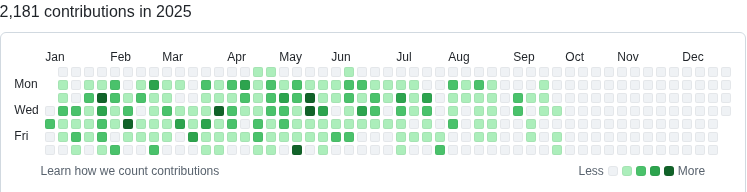

## Hi there 👋 

I'm a passionate Backend developer.

## About Me
- 🏢 Software engineer at [TrackWizz](https://www.trackwizz.com/) since Dec 2023
- ✌️ Personal Github [Sanket-Valani](https://github.com/sanket-valani)

<code></code>
<code></code>
<code></code>
<code></code>
<code></code>

## GitHub Contributions & Achievements

